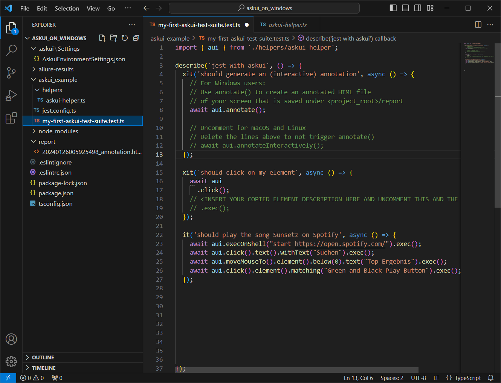

# AskUI on Linux

## Prerequisites

Check if you have the following requirements, before you start the process.
- You need an AskUI account. Don't have one? Sign up for a [7-day free trial here](https://www.app.askui.com)!
- Consider using an IDE. We recommend [Visual Studio Code](https://code.visualstudio.com/).

## Setup

### Step 0: Create an AskUI Account

:::warning
As we need to prevent misuse of our API, we need you to create some credentials through our [__AskUI Studio__](https://app.askui.com/).

Please [sign up for a 7-day free trial](https://www.app.askui.com).
:::

### Step 1: Download Installer

```bash
# Download installer into /tmp folder
curl -o /tmp/AskUI-Suite-24.7.1-User-Installer-Linux-x64-Full.run https://files.askui.com/releases/Installer/24.7.1/AskUI-Suite-24.7.1-User-Installer-Linux-x64-Full.run
```

<details>
  <summary>
  It will install the following components:
  </summary>
    * [AskUI Controller](../../../suite/02-Components/AskUI-Controller.md)
    * [AskUI Development Environment (ADE)](../../../suite/02-Components/AskUI-Development-Environment.md)
    * AskUI Development Kit (SDK)
    * (optional) [AskUI Runner (Executing workflows from AskUI Studio)](../../../suite/02-Components/AskUI-Runner.md)
</details>

### Step 2: Setup AskUI on Your Computer
Run the installer:

```bash
bash /tmp/AskUI-Suite-24.7.1-User-Installer-Linux-x64-Full.run
```

* Press `Enter` to review the license agreement. Then press and hold Enter to scroll.
* Accept the license agreement.

Answer the questions:
* Do you use a proxy?
* Do you want to make AskUI Command globally available?

:::tip
Close and re-open your terminal window for the installation to take effect.
:::

### Step 3: Activate the AskUI Development Environment (ADE)
Open a terminal and run the following command:

```shell
# If you made the command globally available
askui-shell

# If you have NOT made the command globally available
~/.askui-suites/Tools/askui-shell
```

Activating the ADE may take a few seconds.

:::info
If you are not sure what an ADE command does, you can run `Get-Help <command>` to get more information about it.
:::

### Step 4: Connect Your AskUI Account

:::info
As we need to prevent misuse of our API, we need you to create some credentials through our [__AskUI Studio__](https://app.askui.com/).

Please [sign up for a 7-day free trial](https://www.app.askui.com).
:::

Run the following command to authenticate and connect your ADE to your AskUI account. Replace `<access token>` and `<workspace id>` with your real credentials from AskUI Studio.

```shell
AskUI-SetSettings -WorkspaceId <workspace id> -Token <access token>
```

<details>
  <summary>
  How do I get credentials?
  </summary>
  - **Access Token** You can create a new access token inside [__AskUI Studio__](https://app.askui.com/). Go to any Workspace and navigate to *Access Tokens* in the left sidebar.
  - **Workspace ID** Navigate to your workspace settings. You can find the workspace ID under *General* below the workspace name.

  Validate the settings with the following command: 

  ```shell
  AskUI-ShowSettings
  ```
</details>

### Step 5: Start the Controller

:::info
You have to disable mouse acceleration for the AskUI Controller to work properly!
:::

Start the AskUI Controller with:

```shell
AskUI-StartController -RunInBackground
```

### Step 6: Create a New Project
Switch to a directory where you want to create the new AskUI project and run:

```shell
AskUI-NewProject -ProjectName askui_first -TestFramework jest -TypeScriptConfig true
```

### Step 7: Open Your Project
Your new AskUI project has now been created inside the folder you specified and its path is set as your current working directory: `<path you ran AskUI-NewProject>/<your_askui_project_name>`.

Now open this folder with your IDE of choice.

<details>
  <summary>
  Details of the AskUI project setup
  </summary>
  If you are using Visual Studio Code, you can run the following command in the same command prompt:

  ```shell
  code .
  ```
  On the left, in your file explorer, you should see the files that make up your AskUI project.
  1. `.askui\Settings` - Global Project Settings
  2. `allure-results` - AskUI reporter files will be generated here
  3. `askui_example` - Workflow Files  
      a. `helpers` - Helper functions for your project  
      b. `jest.config.ts` - Jest Automation Framework Settings  
      c. `my-first-askui-test-suite.ts` - An example workflow file
  4. `node_modules` - Packages needed to make AskUI work
  5. `report` - Annotations will be generated here

  
</details>

### Step 8: Open a Workflow File
The workflow files are where you will write your automation scripts.
To find them, navigate to the `askui_example` folder.

The project comes with one **template workflow**, which is called `my-first-askui-test-suite.ts`.

On the next page, you will dive deeper into how to write instructions in the AskUI automation framework.

## Next Steps

You are now ready to create your first workflow with AskUI! Please go to the next page [Write Your First Instruction](../write-your-first-instruction.md).
